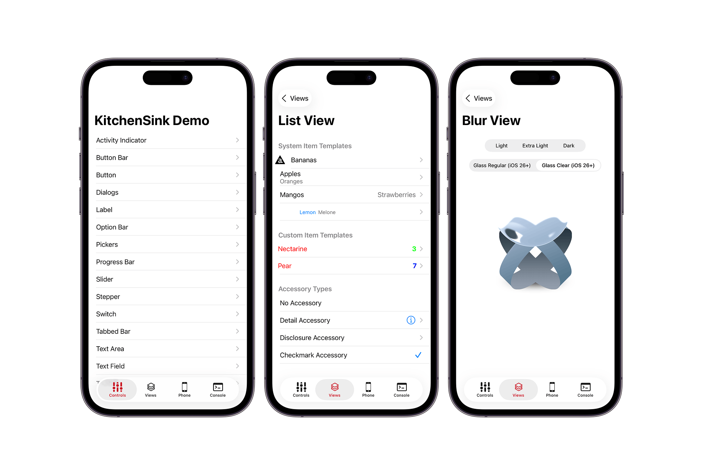

## Kitchen Sink 2.0

This project gives an overview of native components available in Titanium.
The components are grouped into multiple groups and can be logged in the "Logs" tab.
It also includes full support for iOS, Android & Windows.

### Features

- [x] Full ES6+ support
- [x] API Logging
- [x] Controls (Switch, Slider, Tabbed Bar, Text Field, Alerts, Dialogs, ...)
- [x] Views (Scroll View, List View, Image View, Blur View, Web View, ...)
- [x] Services (Twitter, Facebook)
- [x] Platform (Clipboard, URL-Schemes, Hyperloop, Databases, Geolocation, Camera, Gallery, ...)
- [ ] TODO: More Platform APIs (HTTP-Requests, Contacts, ...)

### Running the KitchenSink App

#### Via CLI

1.  Clone the repository:

        git clone https://github.com/tidev/kitchensink-v2

2.  To run it with `ti build` first import it to the platform:

        ti create --import --no-services

3.  Build to Simulator or Device:

        ti build -p ios [-T device]

### Contribution

Code contributions are greatly appreciated, please submit a new [pull request](https://github.com/tidev/kitchensink-v2/pull/new/master)!
